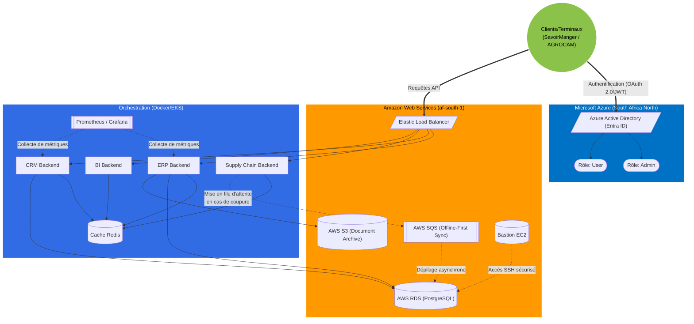

# Architecture Hybride DIGITRANS-CM

Ce schéma illustre la topologie cloud hybride mise en place pour AGROCAM S.A.

## Explications
1. **Authentification** : Lorsqu'un utilisateur d'AGROCAM (ex: vendeur en restaurant SavoirManger) se connecte, l'authentification est gérée par **Azure AD**, garantissant une identité centralisée.
2. **Offline-First** : En cas de coupure de réseau, le module Supply Chain continue de fonctionner localement. Dès le retour de la connexion, les actions sont envoyées dans **AWS SQS** qui agit comme tampon sécurisé avant l'insertion dans la base de données.
3. **Haute Disponibilité** : Les microservices s'appuient sur un cache **Redis** local, allégeant la pression sur la base de données distante (**AWS RDS**) et compensant les problèmes de latence du réseau africain.
